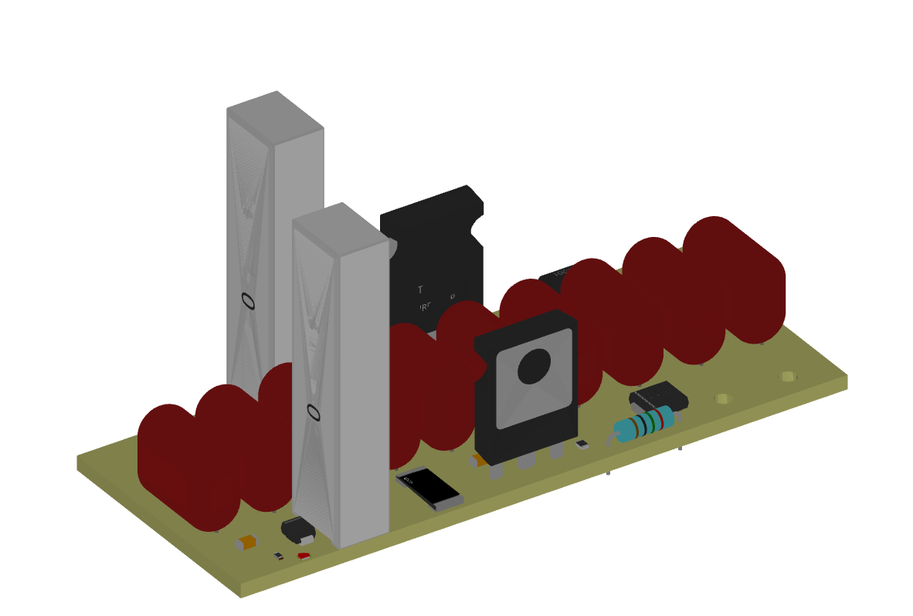
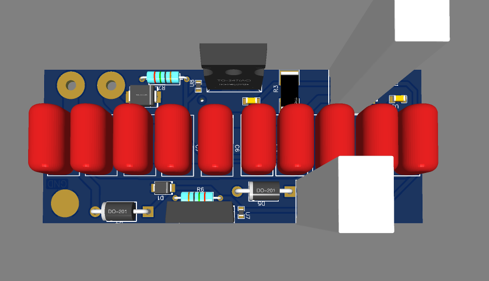

# Indheater
1.4kW ZVS induction heater based upon Schematix's designs.  
Materials needed:
- 2x Wakefield-Vette, 694-50 Heatsink
- 2x IRFP4668PBF MOSFETs
- 10x 470nF 630VAC Capacitor
- 2x 2.2uF Ceramic 100v Capacitor
- 2x FR307 Fast Diode
- 2x 47R, 5w Metal Oxide
- 2x 470R, 5w Metal Oxide
- 2x 12v, 5w Zener Diode
- 1x SB5H100 Schottky Diode or similar
- 2x 100uH, 15A inductor
- 2x 10k, 1/2w
- 1x 4.7k, 1/2w
- 2x 18ohm 1/2w
- 1x 5mm LED

The PCB should get quite hot as it's managing hundreds of amps. I recommend immersing it in mineral oil.

